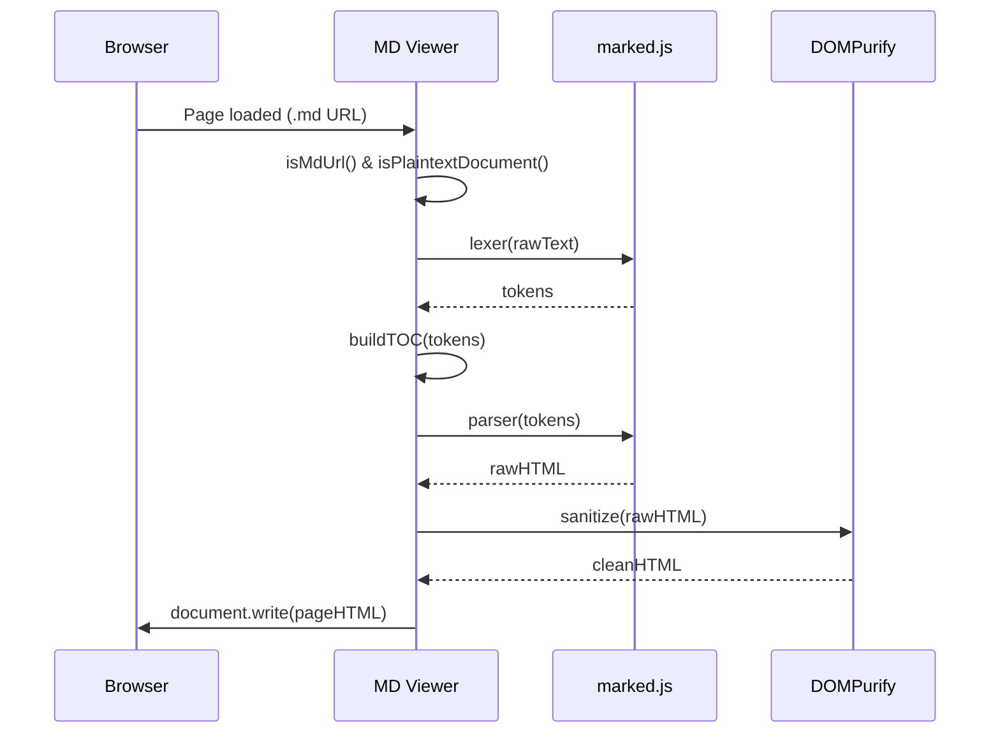

# MD Viewer — Feature Demo

> **MD Viewer** automatically renders `.md` files as beautiful GitHub-style HTML.
> No setup required — just open any `.md` URL in Chrome.

---

## Table of Contents

This sidebar is auto-generated from headings. Scroll down to see it update.

---

## Syntax Highlighting

Supports **11+ languages** out of the box.

### JavaScript

```javascript
async function fetchUser(id) {
  const res = await fetch(`/api/users/${id}`);
  if (!res.ok) throw new Error(`HTTP ${res.status}`);
  const { name, email } = await res.json();
  return { id, name, email };
}
```

### Python

```python
from dataclasses import dataclass
from typing import Optional

@dataclass
class User:
    id: int
    name: str
    email: Optional[str] = None

    def display(self) -> str:
        return f"{self.name} <{self.email}>"
```

### Kotlin

```kotlin
data class User(
    val id: Long,
    val name: String,
    val email: String
)

fun List<User>.findByEmail(email: String): User? =
    firstOrNull { it.email.equals(email, ignoreCase = true) }
```

### Go

```go
type User struct {
    ID    int    `json:"id"`
    Name  string `json:"name"`
    Email string `json:"email"`
}

func (u User) String() string {
    return fmt.Sprintf("%s <%s>", u.Name, u.Email)
}
```

---

## Mermaid Diagrams

````mermaid
flowchart LR
    A([User opens .md URL]) --> B{Is it a .md file?}
    B -- Yes --> C[Extract raw text]
    B -- No  --> D([Do nothing])
    C --> E[Parse with marked.js]
    E --> F[Sanitize with DOMPurify]
    F --> G[Render styled HTML]
    G --> H([✨ Beautiful page])
````



---

## Tables

| Feature | Status | Notes |
|---------|--------|-------|
| GitHub-style rendering | ✅ | Primer CSS inspired |
| Syntax highlighting | ✅ | 11 languages bundled |
| Mermaid diagrams | ✅ | Flow, sequence, gantt |
| Auto TOC | ✅ | Sticky sidebar, scroll-highlight |
| Dark mode | ✅ | System preference + manual toggle |
| Full-width mode | ✅ | Persisted in localStorage |
| Raw source view | ✅ | Toggle anytime |
| Checkbox persistence | ✅ | Saved per file URL |
| XSS protection | ✅ | DOMPurify sanitization |
| File size limit | ✅ | 2 MB guard |

---

## Task List

- [x] Markdown parsing with GFM support
- [x] Syntax highlighting (JS, TS, Python, Go, Java, Kotlin…)
- [x] Mermaid diagram rendering
- [x] Auto Table of Contents with scroll tracking
- [x] Dark / light theme toggle
- [ ] Firefox support *(planned)*
- [ ] Custom CSS themes *(planned)*

---

## Blockquote

> **Security first.**
> All rendered HTML passes through DOMPurify before being written to the page.
> Malicious `<script>` tags and event handlers are stripped automatically.

---

## Inline Formatting

You can use **bold**, *italic*, ~~strikethrough~~, and `inline code` freely.

Links open in a new tab: [marked.js](https://marked.js.org) · [highlight.js](https://highlightjs.org) · [Mermaid](https://mermaid.js.org) · [DOMPurify](https://github.com/cure53/DOMPurify)

---

## JSON

```json
{
  "name": "md-viewer",
  "version": "1.0.0",
  "features": ["syntax-highlight", "mermaid", "toc", "dark-mode"],
  "permissions": [],
  "externalRequests": false
}
```

---

*All rendering happens **locally** in your browser. No accounts. No telemetry. No CDN requests.*
